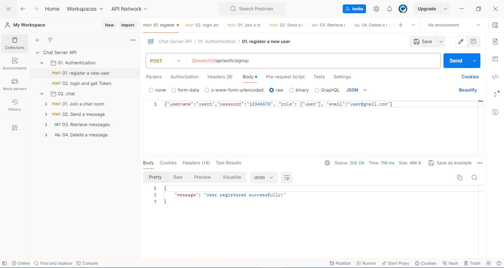
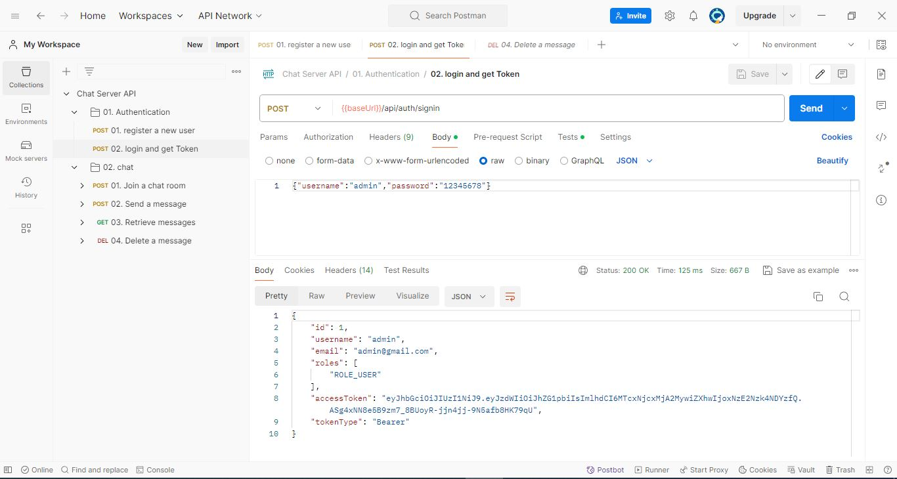
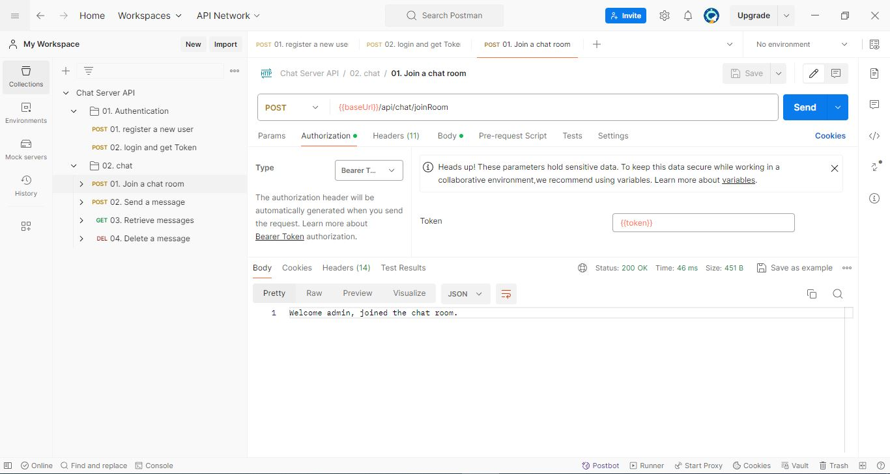
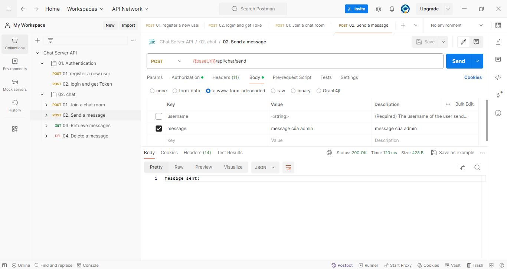
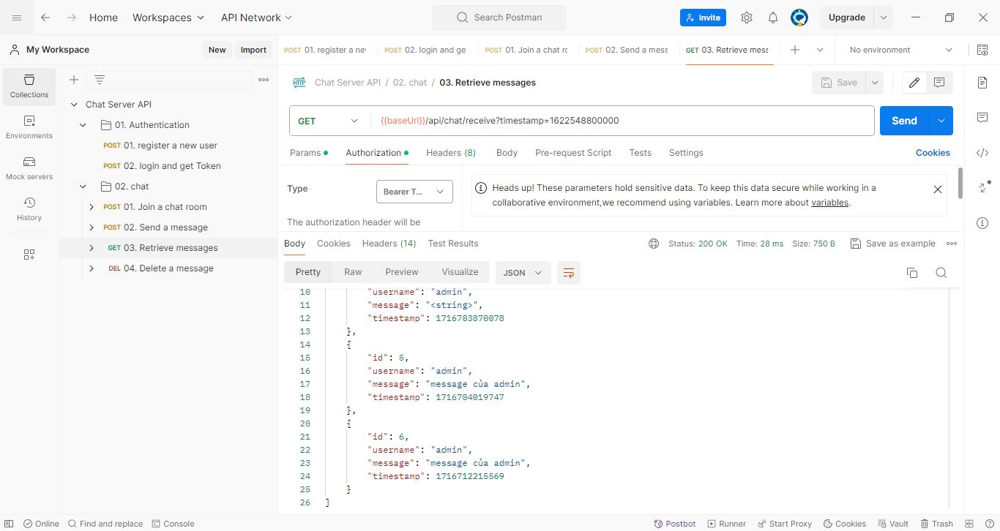
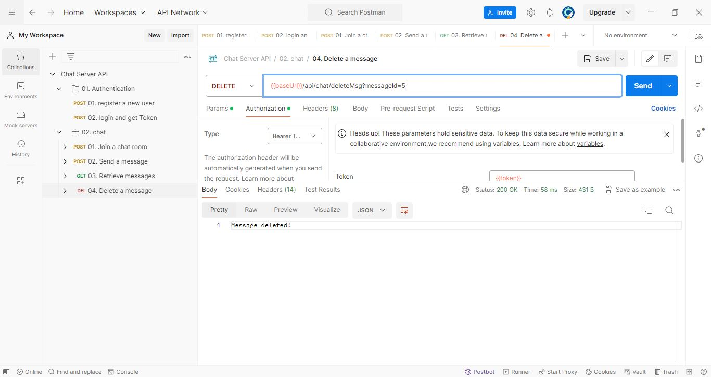
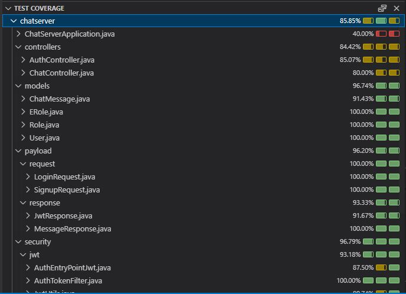

# Backend Java Chat Server Application

## Introduction
Welcome to the Backend Java Chat Server project. This application was developed as part of a coding assessment, focusing on implementing a chat server with user authentication, message handling, and persistent storage. The server supports both RESTful and WebSocket communication for real-time messaging. This README provides an overview of the project, setup instructions, and details on how to test the implemented features.

## What I Have Done
- **Developed a Backend Chat Server application using Java Spring Boot framework.**
- **Implemented Basic Authentication**: Users can register (signup) and log in (sign in) with a username and password. User information is stored in a MariaDB database. JWT token authentication is used for securing REST APIs.
- **Chat REST APIs**:
  - `/joinRoom`: Allows the current user to join a chat room.
  - `/send`: Enables users to send messages to a chat room.
  - `/receive`: Retrieves messages sent in the chat room since a specified timestamp (default is the last 24 hours).
  - `/delete`: Allows users to delete their own messages.
- **Persistent storage**: Chat messages are stored in a database.
- **Unit Testing**: Implemented using JUnit and Mockito.
- **WebSocket Support**: Added for real-time chat communication.
- **CI/CD Skeleton**: Configured using GitHub Actions.
- **Log Management**: Implemented a method to rsync log files from ChatServer rolling Log4J files to Splunk.
- **Docker Support**: Created Dockerfiles for each service (Chat Server, MariaDB, Redis, Nginx, Splunk, Rsync log).
- **Server Scalability**: Ensured the server is scalable.

## Setup Instruction

### Project Structure
The project consists of multiple services organized as follows:
- **ChatServer**: The main application.
- **MariaDB**: The database server for storing user and chat message data.
- **Redis**: Optional, for caching purposes.
- **Nginx**: For handling requests and load balancing.
- **Splunk**: For log management and analysis (TODO).
- **Rsync**: For syncing log files from the chat server to Splunk (TODO).

### Step-by-Step Setup

1. **Clone the repository**:
   \`\`\`bash
   git clone <repository-url>
   cd <repository-directory>
   \`\`\`

2. **Build the project**:
   - Run the build script to clean and package the application:
     \`\`\`bash
     ./01-build.bat
     \`\`\`
   - This script runs the Maven command:
     \`\`\`bash
     mvnw clean package
     \`\`\`

3. **Run the project**:
   - Use the run script to start the application in Windows:
     \`\`\`bash
     ./02-run.bat
     \`\`\`
   - This script runs:
     \`\`\`bash
     java -jar target\chatserver.jar
     \`\`\`

4. **Deploy to Kubernetes cluster**:
   - Use the run script to start the application using Docker Compose:
     \`\`\`bash
     ./03-runAsDocker.bat
     \`\`\`
   - This script runs:
     \`\`\`bash
     docker-compose up --build
     \`\`\`

## Achievements
The following achievements have been realized:

### Testing with Postman
   - Postman workspace: "./Chat Server API.postman_collection.json"
   - Use Postman to test the RESTful endpoints and WebSocket communication. Below are the key endpoints and their functionalities:

- **User Authentication**:
  - **Signup**: \`POST /auth/signup\`
  - **Sign in**: \`POST /auth/signin\`
- **Chat Operations**:
  - **Join Room**: \`POST /chat/joinRoom\`
  - **Send Message**: \`POST /chat/send\`
  - **Receive Messages**: \`GET /chat/receive\`
  - **Delete Message**: \`DELETE /chat/delete\`

#### Snapshots
Include snapshots of Postman illustrating each step:

1. **Signup**:
   
2. **Sign in**:
   
3. **Join Room**:
   
4. **Send Message**:
   
5. **Receive Messages**:
   
6. **Delete Message**:
   

### Database:
MariaDB database server. SQL script: ./docker/init.sql

### Code Quality
- **Unit Tests**: Implemented using JUnit and Mockito to ensure functionality. All line of codes of each Java source code have been written Unit test cases.
   

- **Static Code Analysis**: Run SonarQube to analyze the static code quality. To execute the analysis:
  \`\`\`bash
  ./mvnw sonar:sonar -Dsonar.projectKey=<your-project-key> -Dsonar.host.url=<your-sonar-instance> -Dsonar.login=<your-sonar-login>
  \`\`\`

## Final
Thank you for reviewing this project. It demonstrates the implementation of a robust and scalable chat server with various modern features. If you have any questions or need further clarification, please feel free to reach out.
